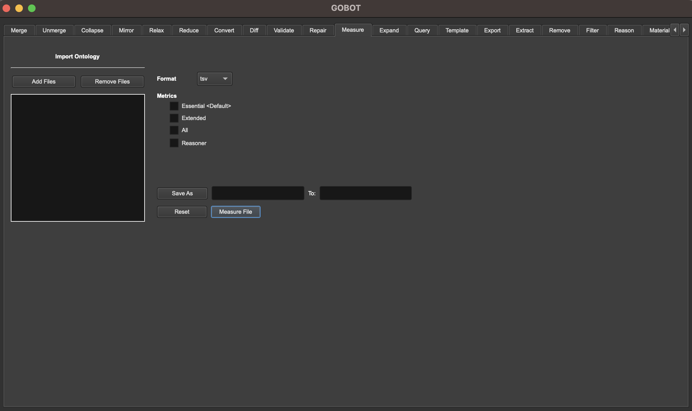

# GOBOT - A Graphical User Interface for ROBOT
GOBOT is a user-friendly graphical interface designed to simplify the execution of ROBOT, a powerful command-line tool for ontology development and processing. With GOBOT, you can harness the full capabilities of ROBOT without the need to write complex command-line instructions. Perform ontology tasks effortlessly and efficiently using a convenient graphical interface.

# Screenshot

# Features
One-Click Operations: Execute ROBOT commands with just a few clicks, eliminating the need to remember or type out lengthy command-line arguments.

Task Automation: GOBOT automates common ontology development and processing tasks, making it easier to manage, edit, and manipulate ontologies.

Cross-Platform Compatibility: Whether you're using macOS or Windows, GOBOT ensures a consistent user experience across all major operating systems.

GOBOT includes a feature that makes your first experience smoother. When you first run GOBOT, it will automatically download the necessary `robot.jar` and `robot` script/batch files. This initial download will occur while you're presented with the splash screen and will take around 1 minute to complete. Subsequent launches of GOBOT won't require this download, ensuring a quicker startup (unless these files are deleted).

GOBOT provides a user-friendly interface for executing various ROBOT commands, implementing 22 of ROBOT's functions. Each function corresponds to a specific task, and you can find the source code for these functions in the project. Here are the supported functions:

- **Collapse**
- **Convert**
- **Diff**
- **Expand**
- **Export**
- **Extract**
- **Filter**
- **Materialize**
- **Measure**
- **Merge**
- **Mirror**
- **Query**
- **Reason**
- **Reduce**
- **Relax**
- **Remove**
- **Rename**
- **Repair**
- **Report**
- **Template**
- **Unmerge**
- **Validate**

# Getting Started

**Option 1: Download the Precompiled Executable (Recommended)**

**Download GOBOT:**

Visit the Releases page on the GOBOT GitHub repository.
Download the precompiled executable for your operating system (Windows/macOS).

**Run GOBOT:**

Launch the downloaded GOBOT application on your computer.

---

**Option 2: Build from Source Code**

**Clone the Repository:**

Clone the GOBOT repository to your local machine using Git:
- Using HTTPS:
  `git clone https://github.com/LukeLiu56809/GOBOT.git`
- Using SSH:
  `git clone git@github.com:LukeLiu56809/GOBOT.git`

**Open in QT Creator:**

Open QT Creator (make sure you have QT version 6 or higher installed).

**Build the Project:**

Locate the `.pro` file at `src/GOBOT/GOBOT.pro` in the cloned repository.
Open the `.pro` file in QT Creator.
Build the project by clicking the "Run" button or selecting "Build" from the menu.

**Run GOBOT:**

After successfully building the project, you can run GOBOT directly from QT Creator.

**Configure Preferences:**

Set your preferences, such as "Build Settings" or "Project Settings," in QT Creator settings if needed.

# Documentation
For detailed usage instructions and documentation on ROBOT commands, refer to the official [ROBOT documentation](https://robot.obolibrary.org/).

# Acknowledgments
Special thanks to the creators of ROBOT for their powerful ontology processing tool.

# Support
If you encounter any issues or have questions, please feel free to open an issue on the GOBOT GitHub repository.

We hope GOBOT simplifies your ontology development workflow and enhances your experience with ROBOT!

